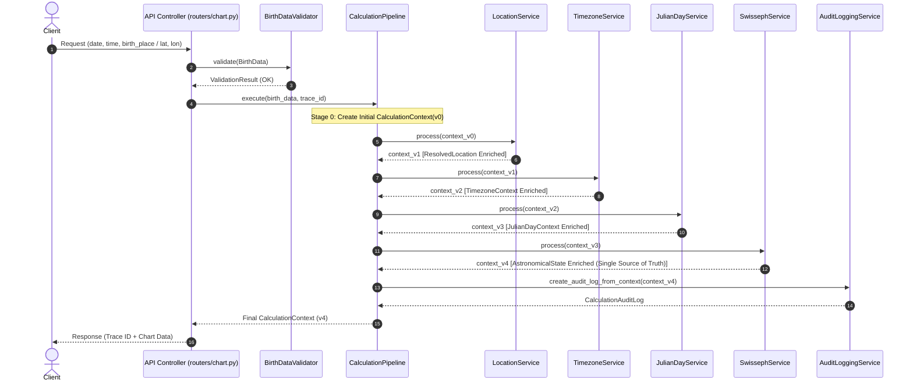
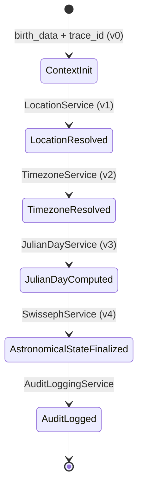
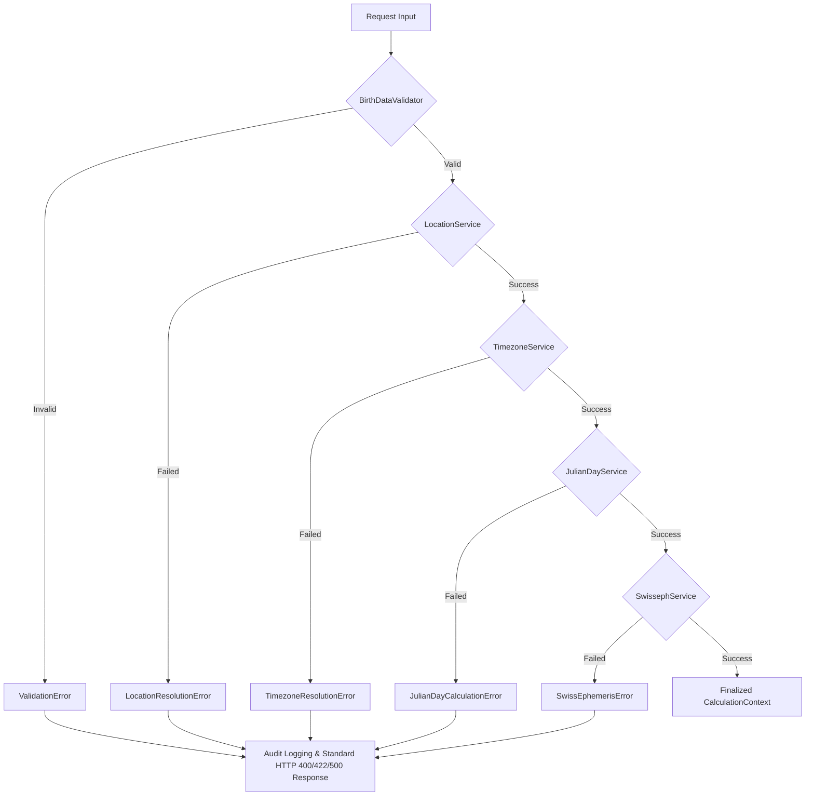

# Phase 3 Architecture: Core Services & CalculationContext Pipeline

## 1. Sequence Diagram

## 2. Pipeline State Diagram

## 3. Error Flow Diagram

## 4. Unified Error Hierarchy Taxonomy

All system exceptions inherit from `EngineError` (`core/errors.py`) and expose:
- `trace_id`: Unique request UUID.
- `stage_id`: Pipeline stage identifier string.
- `error_code`: Machine-readable error code.
- `human_message`: Human-readable error description.

| Exception Class | Base Class | Error Code | Pipeline Stage |
|---|---|---|---|
| `ValidationError` | `EngineError` | `VALIDATION_ERROR` | `VALIDATION` |
| `LocationResolutionError` | `EngineError` | `LOCATION_RESOLUTION_ERROR` | `STAGE_LOCATION` |
| `TimezoneResolutionError` | `EngineError` | `TIMEZONE_RESOLUTION_ERROR` | `STAGE_TIMEZONE` |
| `JulianDayCalculationError` | `EngineError` | `JULIAN_DAY_CALCULATION_ERROR` | `STAGE_JULIAN_DAY` |
| `SwissEphemerisError` | `EngineError` | `SWISS_EPHEMERIS_ERROR` | `STAGE_SWISS_EPHEMERIS` |
| `PipelineExecutionError` | `EngineError` | `PIPELINE_EXECUTION_ERROR` | `PIPELINE_ORCHESTRATION` |
